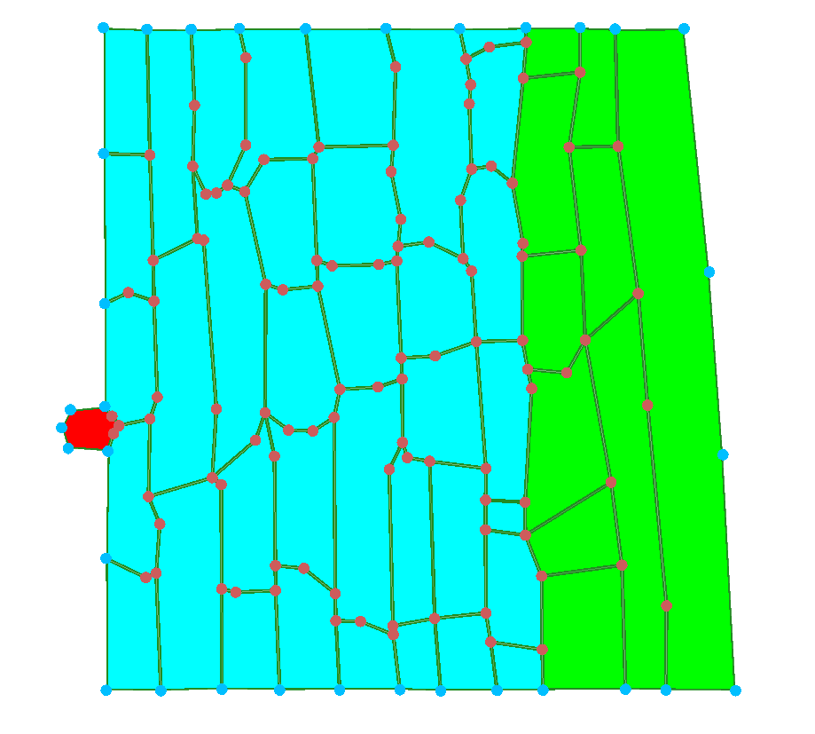
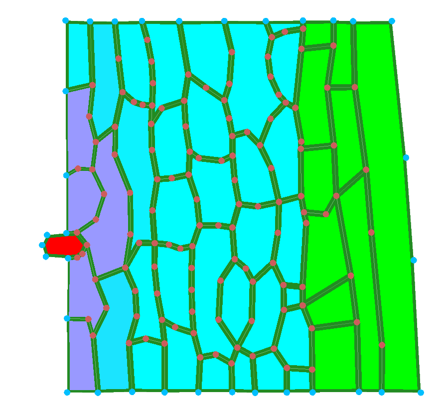
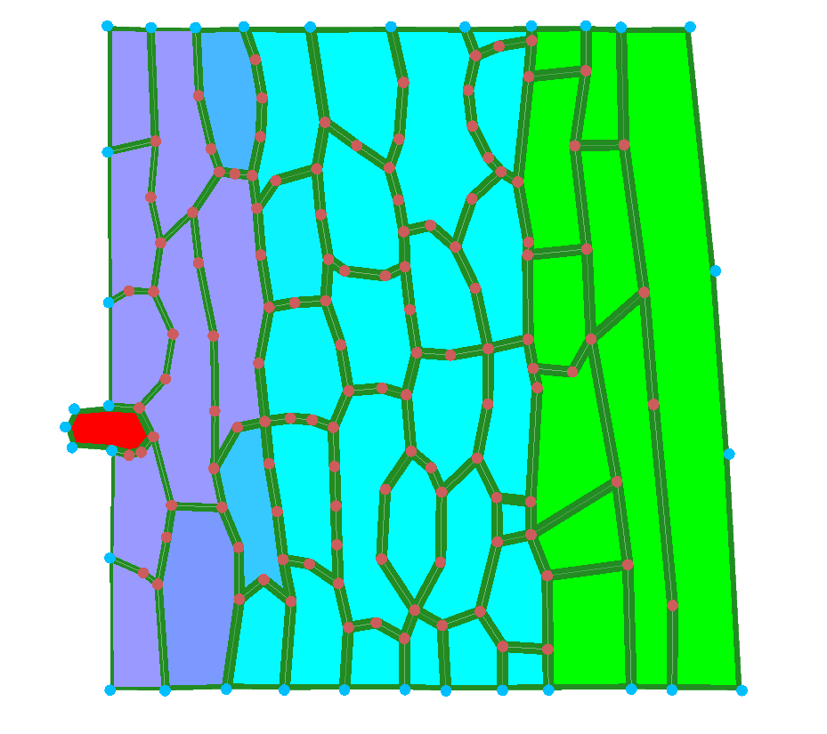
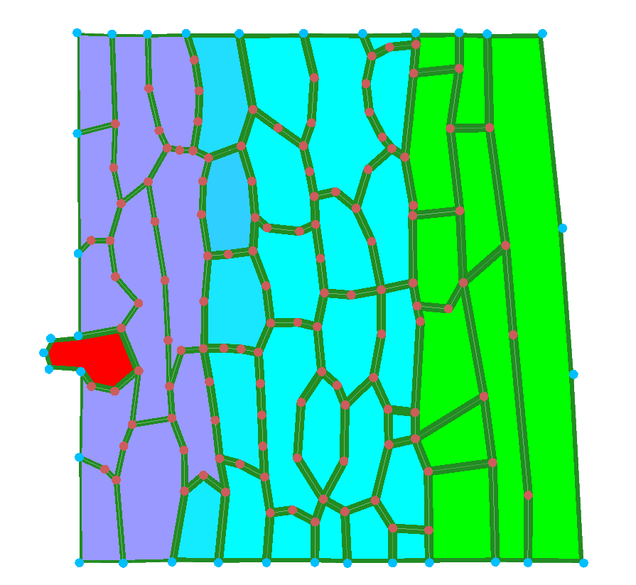

# Multi-scale modelling of biological systems - KEN3170: Plant Tissue Simulations

## Setup

No programming was used in the exercises, thus this README is the only source we created.

To conduct the exercises, install [VirtualLeaf](https://github.com/rmerks/VirtualLeaf2021) software on your computer (check the latest release).

## Exerices

### Q1: Open pathogen_infection model and run for a duration of 2h. Screenshot initial and every 30 min. Describe how the infected region spreads and how the tissue deforms.

Pathogen starting from the left side of the leaf. At first, the size of the cell does not change that much, only after 1 hour the change in size is visible. The infected region is still only a single cell and does not divide yet.

Immediately after the infection, the walls of the tissue stiffen (represented by bold boundaries). As the simulation progresses, the walls directly adjacent to the pathogen bend, and cells become smaller.
We can also see that more and more cells near the pathogen region become purple, as they become affected by the chemicals released by the pathogen (see method `Infection::SetCellColor` in `models/Infection/Infection.cpp`)

#### Infection change over time:

1. Initial state
   

2. After 30 minutes
   

3. After 1 hour
   

4. After 1 hour and 30 minutes
   

5. After 2 hours
   

### Q2: In the model files (Github repo – Models – Infection – infection.cpp9: Read CellHouseKeeping). In your own words: how is a cell's wall stiffness reduced as a function of its chemical level? What does the pathogen do differently?

The wall stiffness of a plant cell depends on the concentration of the pathogen chemical (`Chemical(0)`). The chemical level is divided by 0.5 and capped at 1.2. When the scaled chemical level is above 0.1, the wall stiffness is reduced from its default value of 3 according to:

`stiffness = 3 - patho_chem_level`

This means that a higher chemical concentration makes the cell wall weaker, with a minimum stiffness of 1.8. The affected cells also allow wall reconfiguration.

Pathogen cells (`CellType == 2`) behave differently. They keep their default stiffness of 3 and do not allow wall reconfiguration. Instead, they increase their target area and divide when their area exceeds the division threshold. They also produce the chemical, while non-pathogen cells degrade it.

### Q3: In the model files (Github repo – Models – Infection – infection.cpp9: Read CelltoCellTransport). How is the diffusion coefficient defined? Explain the feedback loop this creates and sketch it: chemical lowers stiffness, lower stiffness raises diffusion, faster diffusion spreads the chemical. Is this positive or negative feedback?

### Q4: Raise and lower rel_cell_div_threshold. How does it change how fast the pathogen population expands? Document two runs.

### Q5: What is a fundamental difference regarding cell neighbours in this model compared to all other models that you have worked with so far?

In the Infection model, cell neighbours can change through wall reconfiguration, even without cell division. When the pathogen chemical weakens the walls of plant cells, the affected cells allow wall reconfiguration. This can change which cells share a wall and create new neighbouring relationships.

Unlike a model where cell contacts remain unchanged between divisions, the Infection model explicitly controls wall reconfiguration based on the chemical concentration. However, the repository does not establish that all previous models prevented this process.

### Q6: The plant evolves a defense: cells above a chemical threshold stiffen their walls. Describe in pseudocode where in CellHouseKeeping this would go and what sign of feedback it adds. Do not implement it. Pseudocode for the different sections is enough!
